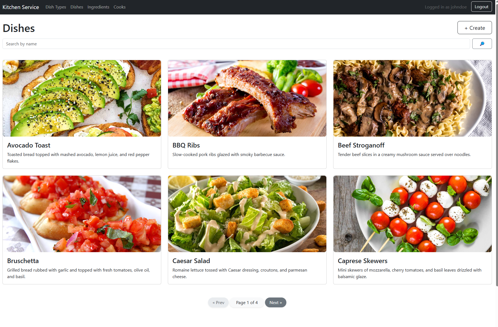
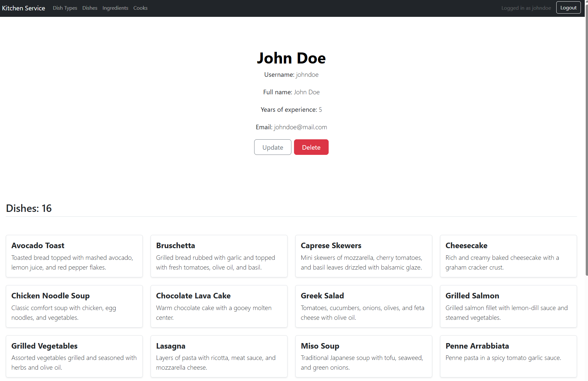

# Restaurant Kitchen Service

Restaurant Kitchen Service is a web application for managing kitchen staff and dishes in a restaurant. It allows users to manage dishes, cooks, ingredients and dish types.

## Live Demo

The project is deployed on Render. You can access it here:  


## Test Credentials

To help you explore the functionality, you can log in using the following test user credentials:

- **Login:** admin
- **Password:** admin12345

## Features

- CRUD for dishes, ingredients, and dish types
- Manage cooks and assign them to dishes
- Filter dishes and ingredients using search forms
- User authentication and authorization
- Pagination for pages to make it easier to view large numbers of records.


## Installation

Follow these steps to run the project locally:

1. Clone the repository
   ```bash
    git clone https://github.com/rezehor/restaurant_kitchen_service
    cd restaurant_kitchen_service

2. Create a virtual environment:
- python -m venv venv
- source venv/bin/activate  # On Windows: venv\Scripts\activate

3. Install dependencies
- pip install -r requirements.txt

4. Apply migrations
- python manage.py makemigrations
- python manage.py migrate

5. Run the development server
- python manage.py runserver

Now, open http://127.0.0.1:8000/ in your browser to access the app

### Login


### Dishes



### Cooks




